import Laboratoire from '/laboratoire.mdx';

# Rencontre 11

## Contenu
- Présentation de Database Diagrams dans SQL Server Management Studio

| |
| --- |
|  |
<details>

</details>


- Présentation du laboratoire de révision
- Explication d'un contrôleur et de ses vues générées
- Révision

## Ressources et documentation: 
- [W3Schools_Input_Types](https://www.w3schools.com/html/html_form_input_types.asp)

## Activités de la séance

### Théorie:  
- 🔗[Cours_11.pptx](https://cegepedouardmontpetit.sharepoint.com/:p:/s/CMT420InformatiqueComitesCours-3W6/ET-sz19NyfBMgqyhInqc5IcB7qmBlru8fkV1p9B9OEKJaw)


### Laboratoires
- Groupe 1010 🔗[1010 S11_Revision](https://classroom.github.com/a/W1s1RQKG)
- Groupe 1020 🔗[1020 S11_Revision](https://classroom.github.com/a/46E1CVLa)
- Groupe 1030 🔗[1030 S11_Revision](https://classroom.github.com/a/lYiP97xv)
- Groupe 1040 🔗[1040 S11_Revision](https://classroom.github.com/a/6U-XO-zO)


### Travail personnel: 
- Terminer le laboratoire de révision
- Travail sur le [TP1](/tp/tp1)

### Révision

<details>
#### Views et PartialViews

```csharp title="Contôleur Zombie"
public IActionResult UneAction()
{
    Zombie z = new Zombie(){
        Name = "Nom du zombie"
    };

    // Par défaut, la vue qui est construite porte le nom de l'action et se trouve dans le répertoire qui a le nom du contrôleur
    return new View(z);
    // Il est possible de retourner une vue par son nom
    // return new View("AutreNom", z);
}
```

Le modèle d'une vue c'est l'équivalent du paramètre d'une fonction et il est passé dans le contrôleur

```ts title="Vue avec modèle"
@model Zombie

<span>@Model.Name</span>
```

OU

```ts title="Vue avec modèle et HtmlHelper"
@model Zombie

<span>@Html.DisplayFor(model => model.Name)</span>
```


Génère simplement le html

```html
<span>Puant</span>
```

Une vue partielle peut également avoir son propre modèle et on peut fournir la valeur avec le paramètre model

```html title="Vue partielle"
<partial name="_NomDeLaVue" model="valeur"/>
```

#### ViewModels

On nomme ViewModels une classe que l'on utilise spécifiquement pour afficher une vue.

Elle contient généralement:
- D'autres données
    - Des statistiques
    - Des listes pour faire des sélections
- L'état de la page
    - La valeur courrante d'un champ de recherche
    - La pagination lorsque l'on peut voir une grande quantité de données
    - D'autres options


#### TagHelper et asp-for 

Le mot "For" utilisé dans les fonctions suivantes fait référence aux propriétés du modèle fournit:

```ts
@model X
```

Regarder le html généré par les choses suivantes:

```ts
@Html.DisplayNameFor(model => model.Name)
@Html.DisplayFor(model => model.Name)
```

```ts
asp-for="Name"
asp-validation-for="Name"
```

#### EntityFramework (EF)

- Propriétés de navigations
- Relations
    - 1 à N
    - N à N
    - 1 à 1

#### Annotations

Exemples:

```csharp
[StringLength(100, MinimumLength = 20)]

[Range(10,35)]

[Required(ErrorMessage = "EmailRequired")]
```

Révision du ?

Pour les propriétés de navigations avec une clé étrangère, il doit être sur les deux ou pas du tout

```csharp title="Relation obligatoire"
public class Joueur
{
    public int Id {get; set;}

    // Relation obligatoire 1..1
    public int EquipeId {get; set;}
    public Equipe Equipe {get; set;}
}
```

```csharp title="Relation optionnelle"
public class Joueur
{
    public int Id {get; set;}

    // Relation optionnelle 0..1
    public int? EquipeId {get; set;}
    public Equipe? Equipe {get; set;}
}
```


#### Validations

ModelState.IsValid

Comprendre le retour de View vs RedirectToAction!

Comprende la validation client VS serveur VS BD

#### Asynchrone

Comment transformer un méthode pour qu'elle soit asynchrone et puisse utiliser des méthodes asynchrones

3 choses:
- Rendre la méthode async
- Changer le type de retour pour une Task&lt;X&gt; où X est le type qui était retourné
- Ajouter un await devant les appels à des méthodes asynchrones comme ToListAsync()


</details>

## Étapes pour créer la base de données à partir du modèle de classes

Cette section présente les étapes permettant de créer la base de données en utilisant Asp.net Core et Entity Framework. Pour davantage de détails sur la nomenclature utilisée, référez-vous aux rencontres 3 et 4.    

Le diagramme que nous allons utiliser est le suivant. On y retrouve les **3 types de relations** (un à un, un à plusieurs et plusieurs à plusieurs). 

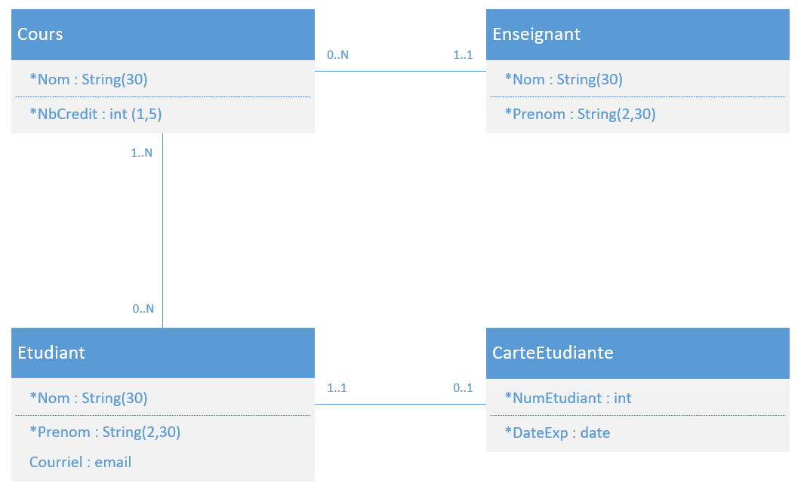

**Note** : Nous avons ajouté peu de propriétés pour alléger le contenu du diagramme. 

 ---

### Étape 1. Création des modèles dans l'application 

Dans l'application, faire un clic droit sur le **répertoire Models pour ajouter les classes**. Nous obtenons alors le résultat suivant :  

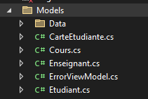

 ---

### Étape 2. Pour chacun des modèles, ajouter toutes les propriétés et les annotations

#### **Modèle Enseignant** : 
- On remarque ici **deux utilisations différentes de StringLength** avec une taille minimale ou non.

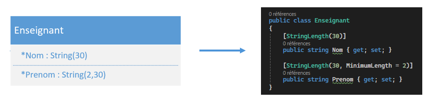

---

#### **Modèle Cours** : 
- Ici, nous utilisons **Range** pour les **int**. 

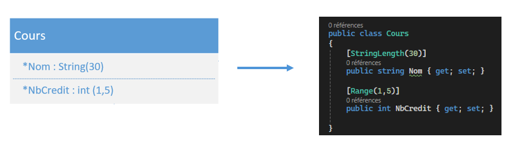

---

#### **Modèle CarteEtudiante** :
- Ici, nous utilisons **DateTime** pour les dates.  

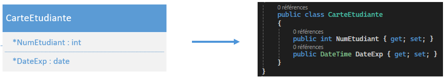

---

#### **Modèle Etudiant** : 
- Ici, nous faisons la distinction **entre les propriétés obligatoires et celles qui sont optionnelles**. 

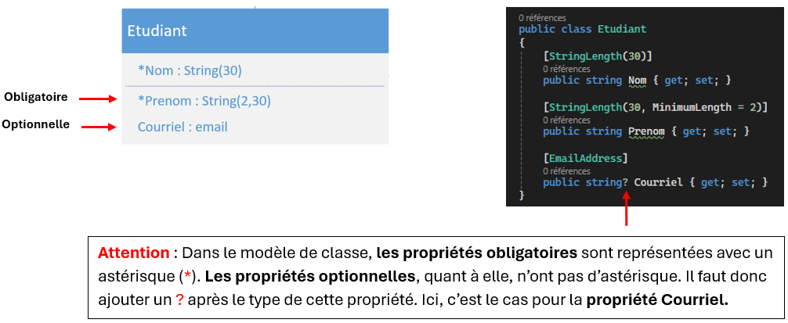

- **Annotation [Required]** : Pour les **propriétés obligatoires**, vous n'êtes pas obligé d'ajouter **l'annotation [Required]** à vos propriétés. Par défaut, les propriétés non optionnelles sont considérées comme requises. 

---


### Étape 3. Ajouter la clé primaire dans chacun des modèles : 
- Dans l'exemple suivant, nous avons ajouté la **clé primaire Id au modèle Enseignant et l'annotation [key]**. Il faut le faire pour tous les modèles. 

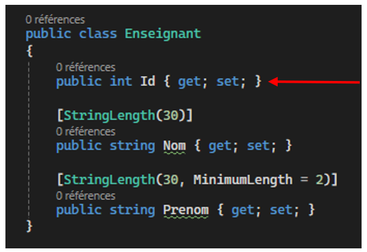

---


### Étape 4. Ajouter les relations entre les modèles et les clés étrangères : 

- Voici une façon de procéder pour représenter les relations 

### 1. Relation Un à Plusieurs : 

- Dans le diagramme nous avons une relation **Un à Plusieurs** entre les modèles **Enseignant** et **Cours**. 

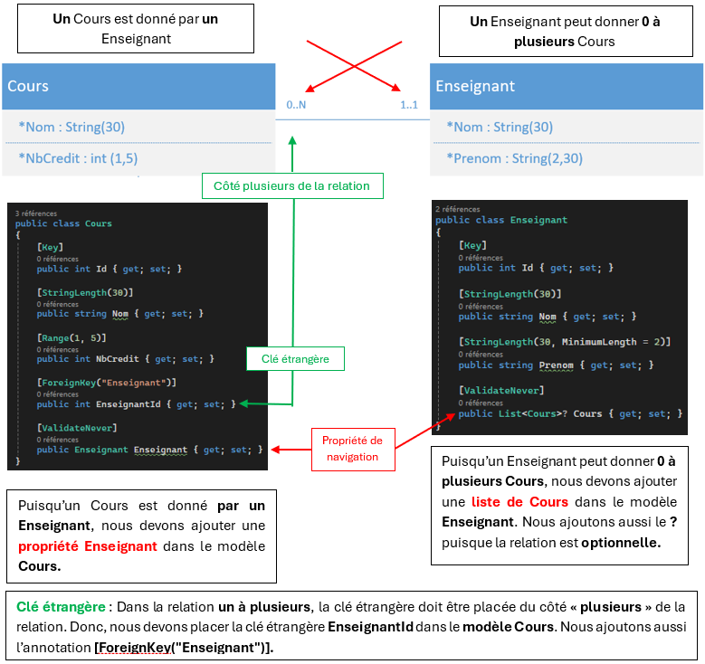

- **Attention** : Remarquez **l'annotation [ValidateNever]** sur **les propriétés de navigation**. Il faut ajouter cette annotation sur **chacune des propriétés de navigation** pour éviter des problèmes de validation au niveau du **ModelState.IsValid**. 

---


### 2. Relation Plusieurs à Plusieurs : 

- Dans le diagramme nous avons une relation **Plusieurs à Plusieurs** entre les modèles **Etudiant** et **Cours**. 

 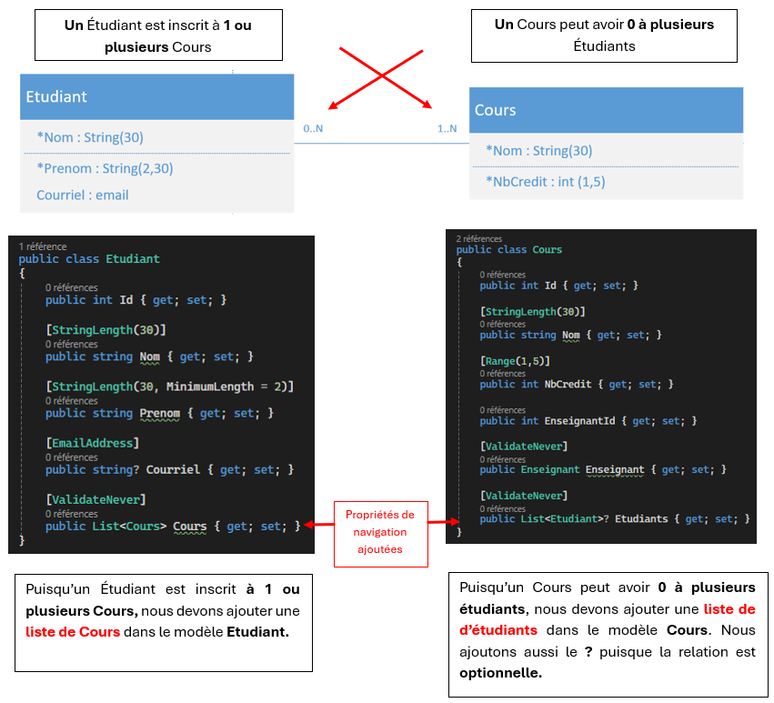


- **Clé étrangère** : Dans cette relation, nous n’avons pas à ajouter de clés étrangères. 

- **Table associative** : Puisqu’il s’agit d’une relation **Plusieurs à Plusieurs**, Entity Framework va générer pour nous une table associative dans la base de données. Si nous voulions stocker des informations supplémentaires entre ces deux modèles, par exemple la note de l’étudiant, il faudrait nous-même créer un modèle qui représenterait la table associative et qui aurait des relations avec Etudiant et Cours. 

---


### 3. Relation Un à Un : 

- Dans le diagramme nous avons une relation **Un à Un** entre les modèles **Etudiant** et **CarteEtudiante**. 

 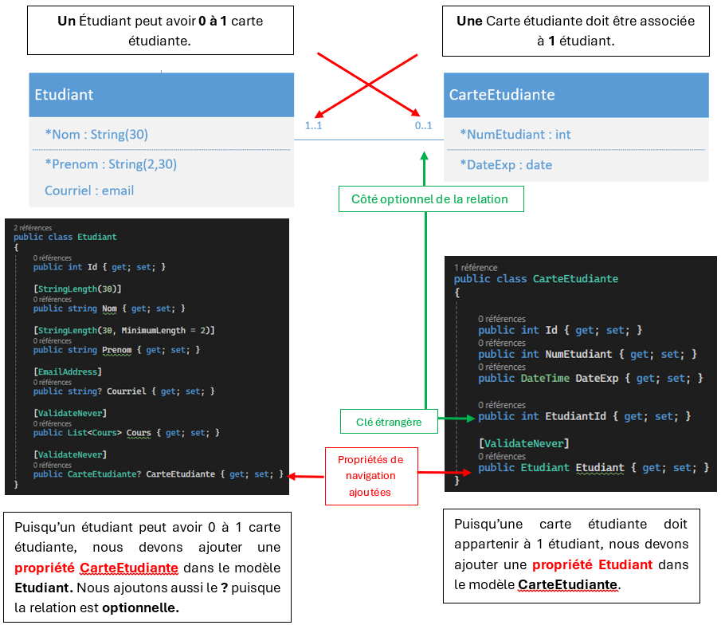
 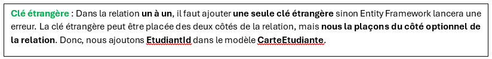

 ---

### Étape 5. Ajouter les DbSets dans le DbContext: 

- **Pour chaque modèle** ajouté, il faut ajouter un **DbSet dans le DbContext**.

 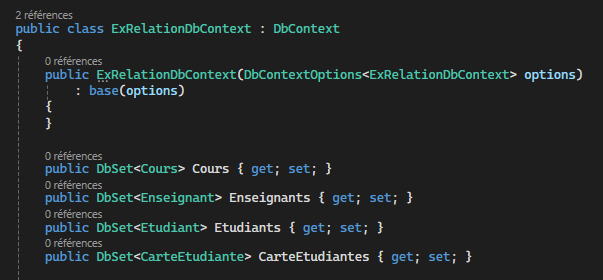

 ---

### Étape 6. Créer la migration et la base de données :

1. Dans la **console de gestionnaire de package**, faites la commade suivante pour **créer la migration**. 

```
add-migration nom_migration
```

-   Assurez-vous que la migration a été créée et qu'elle **n'est pas vide** (exemple du fichier de migration avec contenu partiel). 

 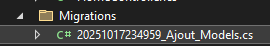

 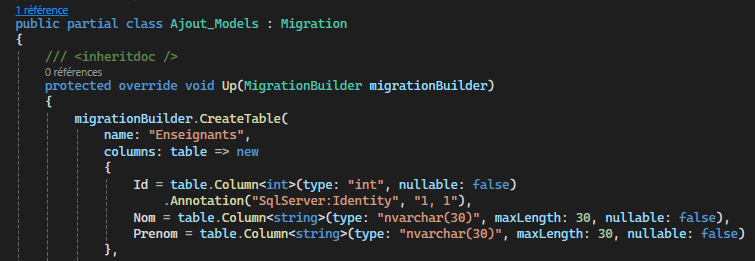


2. **Créer la base de données** avec la commande suivante 

```
update-database
```

- Regardez dans **l'explorateur d'objets SQL** si la base de données a été créées et si les tables existent.

 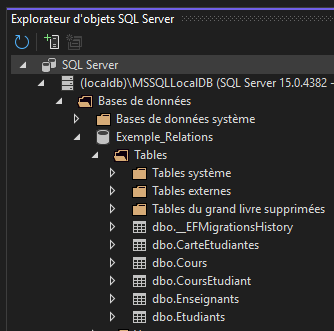

 - Remarquez ici qu'Entity Framework a créé une **table associative CoursEtudiant** puisqu'il y avait une relation **Plusieurs à Plusieurs** entre les tables Cours et Etudiant. 