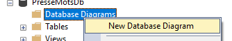
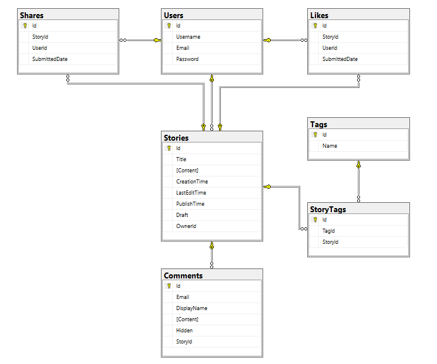

import Laboratoire from '/laboratoire.mdx';

# Rencontre 11

## Contenu
- Présentation de Database Diagrams dans SQL Server Management Studio

| |
| --- |
|  |
<details>

</details>


- Présentation du laboratoire de révision
- Explication d'un contrôleur et de ses vues générées
- Révision

## Ressources et documentation: 
- [W3Schools_Input_Types](https://www.w3schools.com/html/html_form_input_types.asp)

## Activités de la séance

### Théorie:  
- 🔗[Cours_11.pptx](https://cegepedouardmontpetit.sharepoint.com/:p:/s/CMT420InformatiqueComitesCours-3W6/ET-sz19NyfBMgqyhInqc5IcB7qmBlru8fkV1p9B9OEKJaw)


### Laboratoires
- Groupe 1010 🔗[1010 S11_Revision](https://classroom.github.com/a/wZKw1LV2)
- Groupe 1020 🔗[1020 S11_Revision](https://classroom.github.com/a/YVYIS5q-)
- Groupe 1030 
- Groupe 1040 


### Travail personnel: 
- Terminer le laboratoire de révision
- Travail sur le [TP1](/tp/tp1)

### Révision

<details>
#### Views et PartialViews

```csharp title="Contôleur Zombie"
public IActionResult UneAction()
{
    Zombie z = new Zombie(){
        Name = "Nom du zombie"
    };

    // Par défaut, la vue qui est construite porte le nom de l'action et se trouve dans le répertoire qui a le nom du contrôleur
    return new View(z);
    // Il est possible de retourner une vue par son nom
    // return new View("AutreNom", z);
}
```

Le modèle d'une vue c'est l'équivalent du paramètre d'une fonction et il est passé dans le contrôleur

```ts title="Vue avec modèle"
@model Zombie

<span>@Model.Name</span>
```

OU

```ts title="Vue avec modèle et HtmlHelper"
@model Zombie

<span>@Html.DisplayFor(model => model.Name)</span>
```


Génère simplement le html

```html
<span>Puant</span>
```

Une vue partielle peut également avoir son propre modèle et on peut fournir la valeur avec le paramètre model

```html title="Vue partielle"
<partial name="_NomDeLaVue" model="valeur"/>
```

#### ViewModels

On nomme ViewModels une classe que l'on utilise spécifiquement pour afficher une vue.

Elle contient généralement:
- D'autres données
    - Des statistiques
    - Des listes pour faire des sélections
- L'état de la page
    - La valeur courrante d'un champ de recherche
    - La pagination lorsque l'on peut voir une grande quantité de données
    - D'autres options


#### TagHelper et asp-for 

Le mot "For" utilisé dans les fonctions suivantes fait référence aux propriétés du modèle fournit:

```ts
@model X
```

Regarder le html généré par les choses suivantes:

```ts
@Html.DisplayNameFor(model => model.Name)
@Html.DisplayFor(model => model.Name)
```

```ts
asp-for="Name"
asp-validation-for="Name"
```

#### EntityFramework (EF)

- Propriétés de navigations
- Relations
    - 1 à N
    - N à N
    - 1 à 1

#### Annotations

Exemples:

```csharp
[StringLength(100, MinimumLength = 20)]

[Range(10,35)]

[Required(ErrorMessage = "EmailRequired")]
```

Révision du ?

Pour les propriétés de navigations avec une clé étrangère, il doit être sur les deux ou pas du tout

```csharp title="Relation obligatoire"
public class Joueur
{
    public int Id {get; set;}

    // Relation obligatoire 1..1
    public int EquipeId {get; set;}
    public Equipe Equipe {get; set;}
}
```

```csharp title="Relation optionnelle"
public class Joueur
{
    public int Id {get; set;}

    // Relation optionnelle 0..1
    public int? EquipeId {get; set;}
    public Equipe? Equipe {get; set;}
}
```


#### Validations

ModelState.IsValid

Comprendre le retour de View vs RedirectToAction!

Comprende la validation client VS serveur VS BD

#### Asynchrone

Comment transformer un méthode pour qu'elle soit asynchrone et puisse utiliser des méthodes asynchrones

3 choses:
- Rendre la méthode async
- Changer le type de retour pour une Task&lt;X&gt; où X est le type qui était retourné
- Ajouter un await devant les appels à des méthodes asynchrones comme ToListAsync()

</details>
