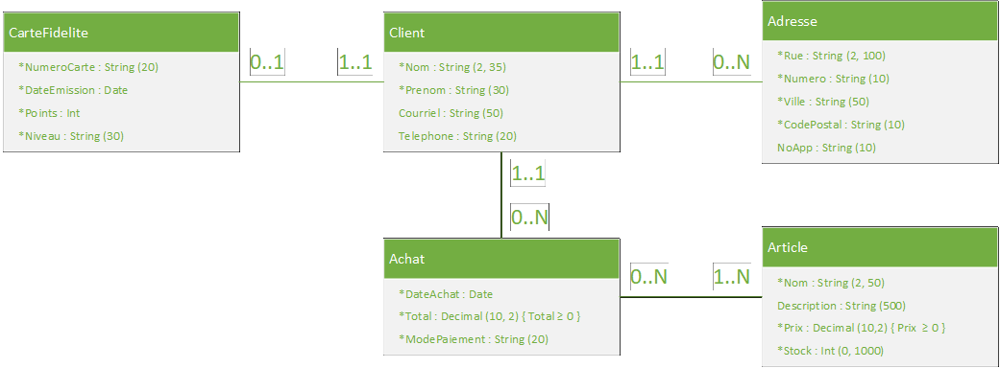

# TP1 : Créer UNE DB à partir d’un modèle de classe

## Consignes
- Ce TP compte pour 5% de la session
- Date de remise : voir l’horaire du groupe
- Il est interdit d’utiliser l’intelligence artificielle, ChatGPT ou tout autre site semblable. La note de 0 sera automatiquement attribuée à votre TP et un rapport de plagiat sera rédigé.

## Modèle de classes
- En vous basant sur le modèle ci-dessous, vous devrez implémenter les classes dans un projet ASP.NET (MVC) et faire le nécessaire pour créer la base de données. 

## Étapes
1. Créer un nouveau projet ASP.NET (MVC).
2. Créer un Repository PRIVÉ nommé 3W6_TP1_NOM_PRENOM dans GitHub qui contiendra votre projet et ajouter votre enseignant comme collaborateur.
3. Implémenter les classes, faire les annotations et les relations.
  - Pour les annotations, pensez à toutes les annotations appropriées : validation (ex. intervalle de valeurs, longueur des Strings, courriel et numéro de téléphone), affichage (ex. DataType pour les valeurs monétaires, dates, courriel et numéro de téléphone), configuration (ex. ForeignKey).
  - Les messages d’erreur des annotations de validation ne sont pas évalués.
  - Vous allez devoir faire une recherche pour comprendre à quoi correspond la notation « Decimal(10,2) » dans un diagramme UML. Vous allez devoir combiner deux annotations pour valider Decimal(10,2) et \{ … ≥ 0\} (valeurs positives uniquement).
4. Faire les configurations pour la connexion à la base de données.
5. Tester que la BD se crée correctement.

## Pondération

| Éléments de correction | Pondération |
| --- | ---: |
| Le projet compile et les fichiers de configuration sont bien complétés | 3 |
| La base de données est créée lorsqu’on exécute la commande update-database | 1 |
| La classe CarteFidelite est implémentée, les annotations et les relations sont correctes | 3.5 |
| La classe Client est implémentée, les annotations et les relations sont correctes | 6 |
| La classe Adresse est implémentée, les annotations et les relations sont correctes | 4.5 |
| La classe Achat est implémentée, les annotations et les relations sont correctes | 4.5 |
| La classe Article est implémentée, les annotations et les relations sont correctes | 4 |
| Le DbContext est bien créé | 3 |
| L’accès au projet sur GitHub fonctionne | 0,5 |
| TOTAL | 30 |

**Note sur la correction** : Les points seront attribués seulement si les éléments de code sont **corrects ET complets**.
