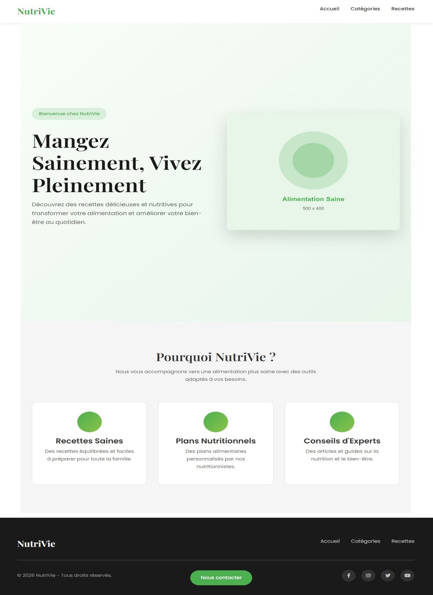
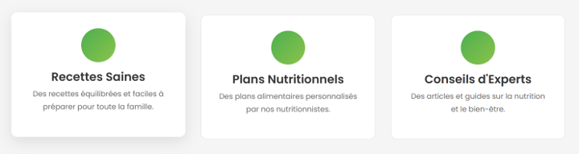
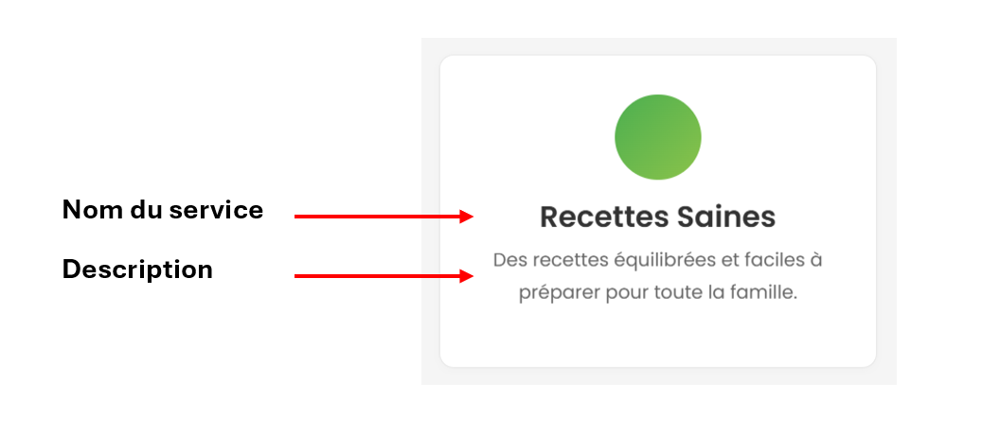

# TP2 créer un projet et implémenter des fonctionnalités

## Github du tp2
- Labo 🔗[TP2](https://github.com/A26ProgWebTrans/TP2)

## Consignes
- Ce TP compte pour 15% de la session 
- L'utilisation de l'IAG pour créer partiellement ou totalement des éléments du travail entrainera automatiquement la note de zéro et un plagiat
- Vous **DEVEZ** faire, au moins, **les migrations et les commits demandés**, mais vous pouvez en faire plus sans problème, tant que vous les documentez correctement.

## Création du projet
1. Créez un Repository PRIVÉ 3W6_TP2_NOM_PRENOM dans GitHub et ajoutez votre enseignant comme collaborateur
2. Créez un nouveau projet MVC qui se nomme NutriVie
3. Utilisez la version **.NET 10**
3. Installez les packages suivants :
    - Microsoft.EntityFrameworkCore **10.0.12 (Dernière version stable)**
    - Microsoft.EntityFrameworkCore.Design **10.0.12 (Dernière version stable)**
    - Microsoft.EntityFrameworkCore.SqlServer **10.0.12 (Dernière version stable)**
    - Microsoft.EntityFrameworkCore.tools **10.0.12 (Dernière version stable)**
    - Microsoft.VisualStudio.Web.CodeGeneration.Design **10.0.2 (Dernière version stable)**
        - NuGet.Packaging **7.9.0 (Dernière version stable)**
        - NuGet.Protocol **7.9.0 (Dernière version stable)**

:::info
Les paquets *NuGet.Packaging* et *NuGet.Protocol* utilisés dans le paquet **Microsoft.VisualStudio.Web.CodeGeneration.Design** ont des vunérabilités importantes et empeiche le bon fonctonnement de la solution. Il est donc important de mettre manuellement les deux paquets afin de temporairement palier au problème.
:::

## Mise en place des fichiers de base du projet
Le dossier Fichiers de départ contient plusieurs éléments que vous devrez intégrer à votre projet pour le faire fonctionner correctement. 

1. Remplacez le **contenu** du fichier de **Layout** de votre projet */Views/Shared/_Layout.cshtml* par celui qui est dans le fichier *_Layout.txt*.
2. Remplacez le **contenu** du fichier **d’index** de votre projet */Views/Home/Index.cshtml* par celui qui est dans le fichier *index.tx*.
3. Remplacez le **contenu** du fichier de **style** de votre projet */wwwroot/css/site.css* par celui qui est dans le fichier *site.css* fourni.
4. Ajoutez le dossier **images** fourni dans le dossier */wwwroot/* de votre projet.
5. Avant de continuer, assurez-vous que votre page d’accueil soit identique à celle-ci :



6. C’est le moment de faire votre commit et votre push, [voir comment bien faire vos messages de commit](https://info.cegepmontpetit.ca/git/).

## Configuration de la base de données et du service sqlserver
1. Faites les modifications nécessaires dans les fichiers de votre projet pour que **la base de données soit fonctionnelle**. Celle-ci devra se nommer *NutriVieEF*. La **classe** pour votre **DbContext** devra se nommer *NutriVieDbContext.cs*
2. C’est le moment de faire votre **commit** et votre **push**.

## Gestion des services
La section **« Pourquoi Nutrivie ? »** de la page d’accueil présente **une liste de trois services** (Recettes Saines, Plan Nutritionnels, Conseils d’Experts).



Pour le moment, ces éléments sont codés de façon statique. Nous allons plutôt stocker ces informations dans la base de données et ensuite les afficher.
1.	Dans le répertoire /Models/, créez une classe nommée Service qui sera gérée par Entity Framework (EF) 
2.	À partir du diagramme ci-bas, ajoutez les champs et les annotations nécessaires à votre classe Service. 
Note : Puisque les services sont dans la page d’accueil (/Views/Home/Index.cshtml), il ne sera pas nécessaire de créer un contrôleur MVC pour la classe Service. Nous utiliserons le contrôleur HomeController déjà présent (/Controllers/HomeController.cs).
3.	Ajoutez un seed de données pour la classe Service. Utilisez les informations des trois services disponibles sur la page d’accueil pour remplir votre seed. 



4.	 Ajoutez une migration et mettez à jour votre base de données. 

5.	Modifiez l’action Index() du HomeController pour qu’elle retourne la liste des services à la vue index.cshtml

6.	Modifiez la vue index.cshtml pour qu’elle utilise les données retournées par l’action Index(). Si vous avez correctement implémenté le code, vous devriez obtenir le même résultat : 


7.	C’est le moment de faire votre commit et votre push.

## Gestion des catégories et des recettes
Nous voulons créer des recettes et associer celles-ci à des catégories, par exemple : Cuisine française.

1. Créez une classe nommée Categorie et copiez le contenu du fichier ClasseCategorie.txt dedans. **ATTENTION** : Elle est partiellement complétée, vous aurez à compléter les relations plus tard.
2. Créez une classe nommée Recette et copiez le contenu du fichier ClasseRecette.txt dedans. **ATTENTION** : Elle est partiellement complétée.
3. Complétez les relations entre les classes Catégorie et Recette sachant qu’une recette appartient à une catégorie et qu’une catégorie peut contenir plusieurs recettes.
4. Générez un contrôleur MVC avec vues pour la classe Catégorie.
5. Générez un contrôleur MVC avec vues pour la classe Recette.
6. Ajoutez le seed de données pour Catégorie et Recette qui est fourni dans le fichier seed.txt.
7. Faites une migration et mettez à jour votre base de données.
8. Modifiez le code pour que les onglets Catégories et Recettes des menus de navigation (header et footer) mènent vers les pages Index respectives.
9. À ce point, vous devriez pouvoir faire des opérations CRUD pour les entités Catégorie et Recette.

**ATTENTION** : Si vous voulez tester la suppression d'une catégorie ou d’une recette, nous vous recommandons d'en ajouter une nouvelle plutôt que de supprimer celles déjà présentes.

10. C’est le moment de faire votre commit et votre push.

### Modifications des vues recettes
Faites les modifications suivantes dans les vues Recettes.

Dans la vue **Index** :
- Affichez le nom de la catégorie plutôt que l’Id.
- Triez les recettes par catégorie et ensuite par nom.
- Affichez les images des recettes avec une largeur de 150 px si elles sont présentes (style intraligne).
- Changez la largeur du contenu de la colonne Description à 250 px (style intraligne).
- Changez les entêtes TempsPreparation et TempsCuisson du tableau par « Durée (min) » et « Cuisson (min) ».
- Résultat attendu :


Dans la vue **Détails** :
- Affichez le nom de la catégorie plutôt que le Id.
- Affichez l'image de la recette en pleine résolution si elle est présente.
- Placez la catégorie avant l’image.
- Si ce n’est pas déjà le cas, changez les titres TempsPreparation et TempsCuisson du tableau par « Durée (min) » et « Cuisson (min) ».
- Résultat attendu :


Dans la vue **Delete** :
- Affichez le nom de la catégorie plutôt que le Id.
- Retirez le temps de préparation, le temps de cuisson et l’image.
- Résultat attendu :


Dans les vues **Edit** et **Create** :
- Dans le Select des catégories, affichez le nom de la catégorie plutôt que le Id.
- Le label de ce champ doit être « Catégorie » plutôt que « CategorieId ».
- Note : Pour la photo, on garde ça simple pour l'instant et on doit taper le nom de l'image de la recette.
- Résultat attendu :


C’est le moment de faire votre commit et votre push.

### Modification de la vue index de categorie
1. Ajoutez une colonne qui affiche les recettes pour chaque catégorie.
2. Les catégories doivent être classées en ordre alphabétique inverse.
3. Pour chaque catégorie, les recettes doivent être ajoutées en ordre alphabétique.
4. Pour chaque recette, nous aimerions afficher le temps de préparation entre parenthèses (voir l’image plus bas).
5. Lorsque l’on clique sur une recette, on doit être redirigé vers la page Edit de cette recette.
6. Résultat attendu :


Note : Si l’on clique sur une recette (ex : Couscous royal), nous serons redirigés sur la page édit de cette recette.

7. C’est le moment de faire votre commit et votre push.

## Implémentation de la logique d’affaires
1. Empêchez la suppression d’une catégorie si celle-ci est associée à au moins une recette.
2. Affichez un message d’erreur approprié (voir image).
3. Assurez-vous que la suppression d’une catégorie qui ne contient pas de recettes fonctionne aussi.
4. Résultat attendu :


5. Empêchez l’ajout d’une catégorie du même nom.
6. Affichez un message d’erreur approprié (voir images).
7. Il faut considérer la casse donc « Orientale » et « orientale » déclenche le message d’erreur.
8. Résultat attendu :


9. C’est le moment de faire votre commit et votre push.

## Vues partielles et fontawesome
1. Créez des vues partielles pour regrouper les boutons d’action Create, Edit et Delete ainsi que le bouton Back to List.
2. Pour obtenir le résultat attendu, vous devrez faire quelques modifications au niveau des classes Bootstrap (voir détails plus bas).
3. Vos vues partielles devront être utilisées dans les vues suivantes :
    - Categories/Create
    - Categories/Edit
    - Categories/Delete
    - Recettes/Create
    - Recettes/Edit
    - Recettes/Delete

**Attention** : Au total, vous ne devrez pas avoir plus de trois vues partielles différentes pour cette section, car il existe 3 actions (Create, Edit et Delete). Chacune de ces vues partielles devra aussi contenir l’action Back to List.

### Classes bootstrap
Pour Categories/Create, Recettes/Create et la vue partielle associée :
- Remplacez la classe form-group du div contenant la vue partielle par la classe d-flex pour que les boutons soient côte à côte.
- Ajoutez une classe Bootstrap pour espacer les deux boutons.
- Ajoutez les classes btn et btn-secondary sur le bouton d’action Back to List.
- Résultat attendu :


Pour Categories/Delete, Recettes/Delete et la vue partielle associée :
- Ajoutez les classes btn et btn-secondary sur le bouton d’action Back to List.
- Retirez le symbole pipe (|).
- Résultat attendu :


Pour Categories/Edit, Recettes/Edit et la vue partielle associée :
- Faire les mêmes modifications que pour Create.
- Résultat attendu :


Utilisez FontAwesome pour les boutons suivants. Ce n’est pas grave si vous n’avez pas exactement les mêmes symboles.

Résultats attendus :


C’est le moment de faire votre commit et votre push.

## Linq : mise en place
1. Avant de commencer cette section, ajoutez une nouvelle classe nommée Aliment.
2. Utilisez le code fourni dans le fichier Classe_Aliment.txt du dossier Fichiers_section_Linq.
3. Il y a une relation plusieurs à plusieurs entre Recette et Aliment. Ajoutez la propriété de navigation nécessaire dans la classe Recette.
4. Ajoutez le seed pour Aliment contenu dans le fichier Seed_Aliment.txt et le DbSet.
5. Mettez à jour votre BD.
6. Puisqu’il s’agit d’une relation plusieurs à plusieurs, vous remarquerez qu’une table associative AlimentRecette a été ajoutée dans la BD.
7. Nous allons créer cette table manuellement pour y stocker de l’information. Créez une nouvelle classe nommée AlimentRecette et utilisez le code fourni dans le fichier Classe_AlimentRecette.txt.

**Attention** : Ne rajoutez pas de clé primaire à cette classe, une clé composée est déjà définie dans la création du dbContext.

8. Ajoutez le seed pour AlimentRecette contenu dans le fichier Seed_AlimentRecette.txt et le DbSet.
9. Puisque Recette et Aliment ne sont plus liés directement, il faut modifier les propriétés de navigation des deux classes.
10. Retirez les propriétés de navigation qui liaient les deux classes et ajoutez cette nouvelle propriété de navigation dans les deux classes :

```csharp
[ValidateNever]
public List<AlimentRecette> AlimentRecettes { get; set; }
```

11. Ainsi, les classes Recette et Aliment sont maintenant liées à la classe associative AlimentRecette.
12. Mettez à jour la BD.
13. C’est le moment de faire votre commit et votre push.

## Linq : requêtes (faire la section mise en place avant)
1. Vous devez créer une page pour afficher des informations sur l’application. Vous devrez avoir un contrôleur et une vue index.
2. Ajoutez un onglet Stats dans le menu de navigation pour accéder à cette page.
3. Vous devez utiliser un ViewModel qui devra contenir les informations à afficher dans cette vue. Nommez-le StatVM.
4. Vous devrez utiliser Linq pour obtenir les informations.
5. Chaque information nécessitera l'utilisation d'au moins une méthode Linq.
6. Vous devez minimalement utiliser les méthodes Linq qui sont spécifiées dans les instructions.

Informations à afficher :
- Le nombre de recettes avec 3 aliments.
- L’aliment le plus calorique.
- Une liste des quatre recettes qui ont le plus court temps total (préparation et cuisson). Vous devez afficher le nom de la recette et le temps total.
- Le nombre de calories de la recette française la moins calorique en utilisant Min et Sum.

Indice : Vous aurez besoin des attributs CaloriesPour100g de la classe Aliment et Poids de la classe associative AlimentRecettes pour faire votre calcul (le poids est en grammes).

Résultat attendu :


Note : Vous n’êtes pas obligé de présenter l’information exactement de la même façon.

C’est le moment de faire votre commit et votre push.

## Affichage d’un menu de recette avec un accordéon bootstrap
Pour cette dernière section, nous allons afficher dans une nouvelle vue des informations sur les recettes en utilisant un accordéon Bootstrap (allez voir le laboratoire 1 de la rencontre 10).

Vous devez avoir fait la section LINQ : MISE EN PLACE avant de faire cette section.

Voici un exemple de ce que l'on doit voir dans ce menu lorsque l'on clique sur une catégorie. Chaque catégorie contient sa liste de recettes et pour chaque recette, nous affichons certaines informations (détails plus bas).


Pour ce menu, vous devrez utiliser une vue partielle pour afficher le tableau et vous devez également utiliser une vue partielle pour afficher le contenu de chaque rangée du tableau.


Vous devrez également utiliser un ViewModel qui doit se nommer RecetteCategorieVM.

Vous devrez également utiliser un ViewModel qui doit se nommer RecetteInfoVM. Celui-ci contiendra les informations de la recette. Le temps total représente la somme du temps de préparation et du temps de cuisson.

Le ViewModel RecetteCategorieVM doit, en plus de ses autres propriétés, contenir une `ListRecetteInfoVM`.

Vous pouvez nommer vos vues comme vous le voulez, mais voici une suggestion :
- Vue principale avec l'accordéon (AllRecettes.cshtml)
- Vue partielle avec le tableau (RecetteCategorie.cshtml)
- Vue partielle avec une rangée du tableau (RecetteInfo.cshtml)

Remarquez que, pour chaque titre de l'accordéon, on affiche le nom de la catégorie.

Pour le statut, il faut afficher un de ces trois messages qui dépend directement du temps total de la recette qui est affiché dans la colonne précédente :
- Recette de courte durée (50 minutes ou moins)
- Recette de durée moyenne (entre 51 et 90 minutes)
- Recette de longue durée (plus de 90 minutes)

Utilisez une couleur différente pour chaque message. Vous pouvez utiliser les classes (text-success, text-warning, text-danger). La logique pour cette fonctionnalité doit se faire dans la vue.

C’est le moment de faire votre commit et votre push.

## Pondération
