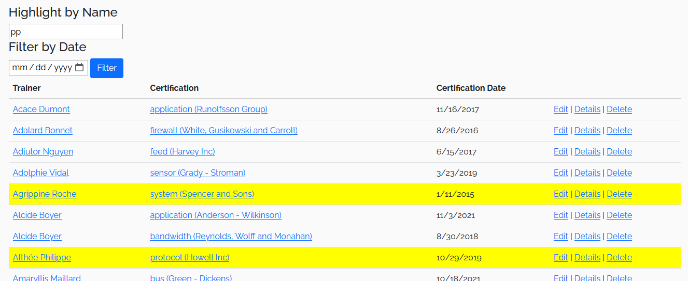
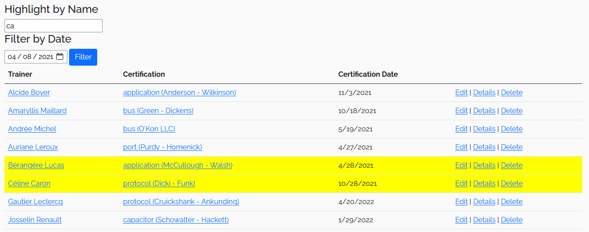

import CommentCommitPush from '/comment-commit-push.mdx';

# TP3

:::danger
🚧 L'énoncé est encore en adaptation et est sujet à changements. 🚧

Attendez la présentation officielle du TP pour travailler dessus.
:::

## Consignes
- Lisez toutes les instructions et la grille de correction avant de commencer
- Vous **DEVEZ** faire au moins les migrations et les commits demandés mais vous pouvez en faire plus sans problème, tant que vous les documentez correctement
- L'utilisation de l'IAG pour créer partiellement ou totalement des éléments du travail entraînera automatiquement un zéro et un plagiat

- Il faut télécharger ce [fichier zip](/tps/tp3/TP3_JuliePro_JS_ViewModelService_DepartE26.zip) 

## Filtre et surlignage des TrainerCertifications

1. Ajoutez le code JavaScript nécessaire pour surligner les rangées (**\<tr\>**) dont le nom du Trainer contient la chaîne de caractères qui est entrée dans la boîte de texte.
2. La recherche de texte doit ignorer la casse (minuscule ou majuscule)
3. Il y a plusieurs façons possibles de résoudre ce problème, mais c'est une bonne idée d'ajouter un attribut **class** sur les **\<td\>** ou les **\<a\>** qui contiennent le **nom du trainer** afin de pouvoir facilement les obtenir dans votre code JavaScript.
4. Le surlignage doit se mettre à jour chaque fois que le contenu du champ texte est modifié.

||
|-|

:::info

Vous pouvez simplement utiliser la propriété de style **backgroundColor** pour faire le surlignage

:::

5. Ajoutez le code javascript nécessaire pour filtrer directement sur le client (donc sans faire de requête au serveur), les données en fonction de la date.
6. Il faut seulement afficher les rangées avec une date égale ou supérieure à la date entrée dans le champ date.
7. Le filtrage s'effectue lorsque l'on clique sur le bouton "filtrer"
8. Encore une fois, il y a plusieurs façons possibles de résoudre ce problème, mais c'est une bonne idée d'ajouter un attribut class sur le **\<td\>** qui contient la date de la certification pour facilement les obtenir dans votre code JavaScript.

||
|-|

:::info

Pour vous aider avec la comparaison de dates, il est possible de créer un objet de date à partir d'une date en utilisant **new Date(dateString)** et un élément de type input possède la propriété **valueAsDate**

:::

:::warning
Il est possible de filtrer et de surligner en même temps.
:::

## Faites fonctionner le filtre de Trainers

1. Modifiez la fonction **Filter** du **TrainerController** pour retourner la vue Index avec l'argument `filter` comme modèle. (Utilisez la méthode GetAllAsync de TrainerService comme dans l'action Index)
2. Modifiez la méthode **GetAllAsync** du service **TrainerService** pour prendre en compte les paramètres de pagination de **TrainerSearchViewModelFilter**
3. Dans la même méthode, il faut également ajouter des **Where** pour filtrer selon chacun des critères de recherche de **TrainerSearchViewModelFilter** (il y a 5 filtres à appliquer)
   - Pour le filtre par nom, il faut accepter un résultat si le nom OU le prénom contient la chaîne de caractères entrée dans le filtre
4. Il faut également remplir les SelectList dans la même méthode (**GetAllAsync**) pour afficher les choix à l'utilisateur.
5. Pour le SelectList de certification centers, il faut obtenir le **CertificationCenter** (une simple string) de toutes les certifications et enlever les doublons, car il est possible que plusieurs certifications aient le même **CertificationCenter**.

:::info

Cette fois-ci le filtrage est effectué sur le serveur en effectuant une nouvelle requête dans la BD.

:::

:::tip

Voici comment on peut faire une requête pour une condition optionnelle dans Linq et ne filtrer que lorsque l'on sélectionne une valeur dans le filtre. 

:::

```csharp

.Where(x => filter.SelectedCategoryId == null || x.CategoryId == filter.SelectedCategoryId )

```

<CommentCommitPush/>

## Affichez le détail d'un **Trainer** dans la page **Trainer/Index**

1. Écrivez du javascript en utilisant **jQuery** pour ajouter la classe **show** à l’élément enfant **aside** lorsqu'on survole le **card** d’un entraîneur.
2. Écrivez du javascript en utilisant **jQuery** pour retirer la classe **show** à l’élément enfant **aside** lorsqu'on ne survole plus le **card**.

:::info

 Comme **aside** est un enfant de **card**, si l'utilisateur bouge sa souris à l'extérieur de la photo de l'entraîneur vers le **aside**, la souris est toujours techniquement au-dessus de **card** et ça ne cause pas d'événement **onmouseout**. **Ça tombe bien, c'est exactement ce que l'on veut!**

:::

||
|-|

:::danger

 Cette vue de détail (encadrée en rouge) est uniquement en anglais et ce n'est pas un problème pour ce TP. Lorsque vous arriverez à la section sur la traduction, n'oubliez pas que vous n'avez **PAS** à traduire cette page.

:::

<CommentCommitPush/>

## Faire fonctionner la pagination

Pour faire fonctionner la pagination, nous allons utiliser deux propriétés importantes du ViewModel que reçoit la vue Trainer/Index.

- La première est l'index de la page actuellement sélectionnée `SelectedPageIndex`
- La deuxième est présente dans la propriété **Items** (qui est un **PaginatedList\<Trainer\>**) et contient le nombre de pages au total `TotalPages`

1. Modifiez le code pour que toutes les pages disponibles soient affichées dans la pagination. 
2. Ajoutez la logique pour que **Previous** et **Next** s'affichent seulement lorsqu'il le faut. 

À chaque fois que nous allons cliquer sur un élément de la liste de pagination:

Nous allons changer la valeur de l'élément "input" correspondant au `SelectedPageIndex` et nous allons resoumettre le formulaire.

3. Ajoutez le JavaScript dans la vue. Utilisez les attributs **data-page-id** qui sont déjà présents sur les éléments de navigation pour savoir quelle page est sélectionnée. Voici quelques indications pour vous aider:
   - Exécutez une fonction JS lorsqu'un élément de pagination est cliqué.
   - Obtenez la valeur du **data-page-id** correspondant à l'élément sur lequel l'utilisateur a cliqué.
   - Obtenez l'élément qui contient l'information du **SelectedPageIndex** dans le formulaire (libre à vous d'ajouter une classe pour vous aider à l'obtenir plus facilement).
   - Modifiez sa valeur (attention aux cas particuliers **Previous** et **Next**).
   - Soumettez de nouveau le formulaire (pour cela on peut simplement utiliser la méthode `submit()` sur l'élément jQuery correspondant au formulaire).
4. Une fois que votre navigation fonctionne bien, mettez le **SelectedPageIndex** (l'élément mentionné dans le point précédent) en **type="hidden"** et supprimez le libellé (label associé).
   

<CommentCommitPush/>

## Générez les vues et le contrôleur (RecordController) du modèle Record

:::warning

 Au moment de générer le contrôleur, il faut le nommer **RecordController** et non pas **RecordsController** (Donc, pas de s!).
 C'est important car les liens existants et les fichiers de traduction utilisent tous Record et non pas Records!

:::

:::danger

Si vous avez une erreur, assurez-vous d'utiliser la dernière version de toutes les librairies dans votre projet 8.0.X. Pendant la génération, le système met automatiquement à jour la version de la librairie Microsoft.VisualStudio.Web.CodeGeneration.Design **qui utilise une version différente**. Au moment d'écrire ces lignes, la version des librairies est maintenant 8.0.28, sauf pour Microsoft.VisualStudio.Web.CodeGeneration.Design qui est à 8.0.23.

:::

:::warning

La génération de contrôleur utilise parfois des @ dans son code et ça cause des erreurs! Vous pouvez simplement remplacer les @ par un nom de variable différent, comme x.

:::

:::warning

La génération de contrôleur utilise des **[bind]** pour les actions **post** de **Create** et **Edit**. À moins que vous soyez déjà familier avec leur utilisation, vous pouvez **simplement les retirer**.

:::

1. Générez un contrôleur MVC avec ses vues pour le modèle Record. (Un lien vers cette vue existe déjà dans la barre de navigation)
2. Lorsqu’il y a un dropdown, au lieu de le mettre dans le ViewData ou le ViewBag, faites un ViewModel (**RecordViewModel**) (ou plusieurs) avec les SelectList et les informations du modèle.

:::warning

Il existe déjà des fichiers .resx pour le view model **RecordViewModel**. Si vous utilisez un autre nom ou utilisez d'autres view models, il faudra s'assurer de faire fonctionner la traduction.

:::

3. Lorsque vous affichez **Trainer**:
   - Affichez le **nom complet** du **Trainer**
4. Lorsque vous affichez **Discipline** 
   - Affichez le **nom** de la **Discipline**
5. Faites un **service** pour gérer la création de ViewModels et les interactions avec le DbContext (Une fois que vous avez terminé, le contrôleur n'utilisera plus directement JulieProDBContext)
6. Utilisez le **service** dans le contrôleur 


<CommentCommitPush/>

## Ajoutez une vue pour voir les **Records** d'un **Trainer**
1. Ajoutez une action à votre contrôleur qui permet de voir les **Records** d'un **Trainer** Record/TrainerIndex(int trainerId)
   - Il existe déjà une icône trophée sur la vue détaillée du Trainer qui doit permettre d'afficher cette page
2. Ajoutez également la vue nécessaire

||
|-|

<CommentCommitPush/>

## Modifiez la vue **Index** du contrôleur **Records** 
1. Ajoutez le code nécessaire afin d'intégrer une librairie js proposant un DataTable (telle que datatables.net), vous pouvez choisir une autre librairie


2. Modifiez la vue afin d'afficher la liste des **records** par discipline et de faire du forage pour afficher le détail des **Records** par **Trainers**  


3. Assurez-vous que le DataTable propose les fonctions de tri par colonne et la pagination


<CommentCommitPush/>

## Terminez de mettre en place **i18n**
#### Ce qui est déjà fait :
   - Les packages NuGet sont installés
   - Les **vues** sont déjà traduites!
   - Les **modèles** aussi!
   - L'injection du **IViewLocalizer** est aussi déjà présente

#### Ce qu’il faut faire :
   - Il faut configurer **i18n** dans **Program.cs**. Les fichiers de traduction **resx** se trouvent dans le répertoire ** /i18n/ **
   - Il faut ajouter une fonction **SetLanguage** au **HomeController**
   - Il manque le commutateur de langue dans le **_Layout**. Utilisez une vue partielle et nommez-la **_SelectLanguage**
   - Finalement, il faut gérer la culture correctement en ajoutant les librairies nécessaires et en modifiant la vue partielle **_ValidationScriptsPartial**. (VOIR: **Séance 24 et son laboratoire**) (Assurez-vous que vous pouvez modifier une entrée avec un nombre avec une décimale en français et en anglais sans problème)

<CommentCommitPush/>

## Vérification de la traduction

1. Assurez-vous que vos **nouvelles** pages sont toutes bien traduites 
   - Il n'est PAS nécessaire de traduire [la vue de détail d'un **Trainer** affichée dans l'index](/tp/tp3#affichez-le-d%C3%A9tail-dun-trainer-dans-la-page-trainerindex)
   - Les resx sont généralement déjà là, utilisez-les
   - Il manque la traduction des messages d’erreur. Assurez-vous de faire la traduction pour les cas suivants:
      - Une valeur de **Amount invalide** (Out of Range)
      - Un champ **Unit manquant** (champ vide)
      - Vous pouvez en faire plus, mais ce ne sera pas évalué. La traduction du message **"must be a number"** est assez complexe, alors ce n'est **pas** conseillé d'essayer de le traduire!
      
   
<CommentCommitPush/>

## Grille de correction

| Tâche | Nb Points |
| :--- | :----: |
| Filtre et surlignage des TrainerCertifications | 5 |
| Faire fonctionner le filtre de Trainer | 5 |
| Afficher le détail d'un Trainer | 1 |
| Faire fonctionner la pagination | 5 |
| Ajouter RecordController | 6 |
| Ajouter une vue pour les records d'un entraîneur | 3 |
| Modifier la vue pour Index les records  (dataTable js) | 5 |
| Terminer de mettre en place i18n | 3 |
| Traduire le contenu ajouté | 1 |
| Commits avec textes pertinents | 1 |
| **Total** | **/35** |
