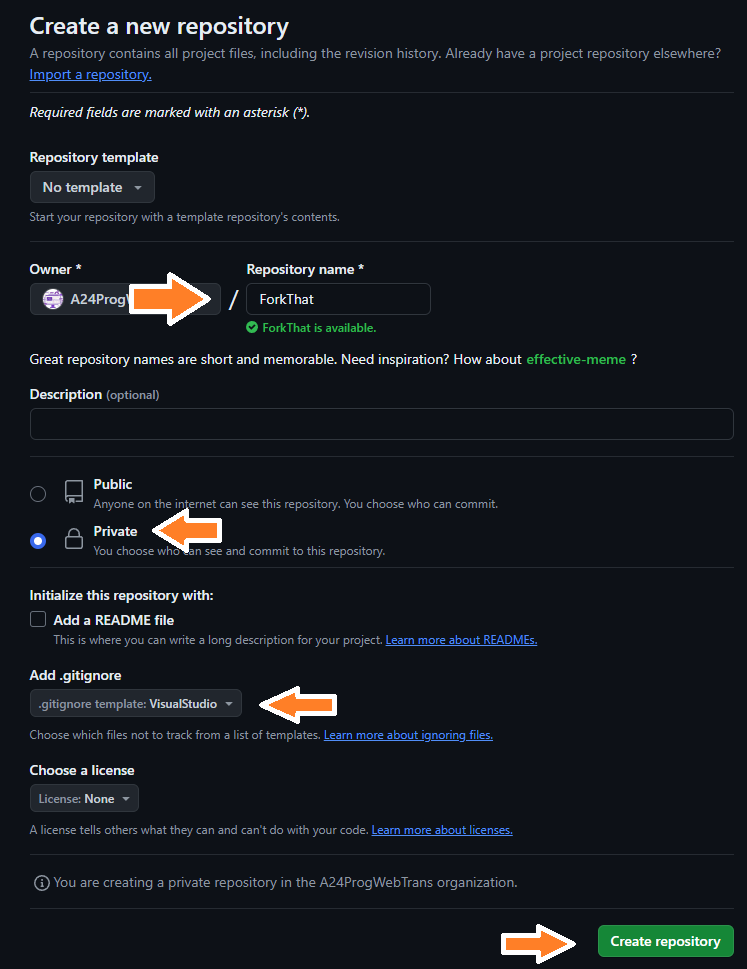
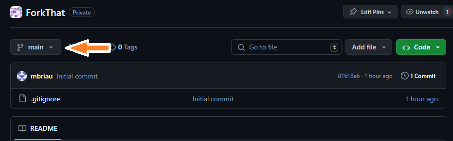

# GitHub

## À quoi ça sert?

Définition

GitHub permet de stocker des projets Git.

GitHub fournit de nombreuses fonctionnalités qui permettent à plusieurs personnes de collaborer sur un même projet, mais pour l'instant vous allez l'utiliser de façon individuelle.

## Les actions

Créer un repository

Cliquez sur **Repositories** et ensuite sur **New repository**

Entrez le **nom**, gardez le repo **private** et choisissez **VisualStudio pour l'option .gitIgnore**

Cloner

Pour obtenir l'adresse nécessaire pour cloner un projet, on clique sur **Code** et ensuite sur le **bouton de copie**.

On peut ensuite utiliser un logiciel comme **Fork** ou GitKraken pour faire le clone avec cette adresse.

Changer de branche

Voir les commits

Voir un fichier (et son historique)

Partager

