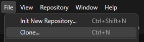

# Fork

## À quoi ça sert?

Définition

Fork permet de cloner et interagir avec un repository Git.

C'est un outil visuel qui permet de remplacer la ligne de commande de Git.

Il permet également de visualiser les différentes branches et commits d'un projet.

## Actions

Ajouter un compte

Cliquez sur File/Accounts...

Cliquez sur le +

Cliquez sur **GitHub** et sur **Login**

Faites l'authentification avec GitHub

Si c'est fonctionnel le compte s'affiche comme ceci

Cloner

Cliquez sur File/Clone...

Il faut:
- Copier l'URL obtenu dans GitHub
- Choisir le répertoire
- Modifier le nom si nécessaire (normalement pas...)

### Voir les changements courants

### Commit

Push

Après un commit, on peut voir que l'on a des changements qui ne sont pas encore sur le serveur GitHub.

On le voit à gauche dans le menu de branches:

Et en haut dans le menu central:

Note: On voit le nombre de commits qui n'ont pas encore été poussés sur le serveur (Dans ce cas, il y en a 1)

Appuyez sur le bouton Push

Vérifiez que l'on est dans la bonne branche et cliquez sur Push

Créer une branche

En cliquant sur le bouton + du menu central

### Changer de branche

### Merger une branche

### Pull